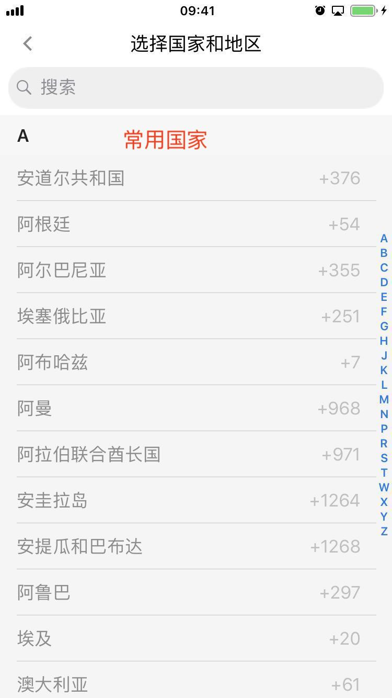
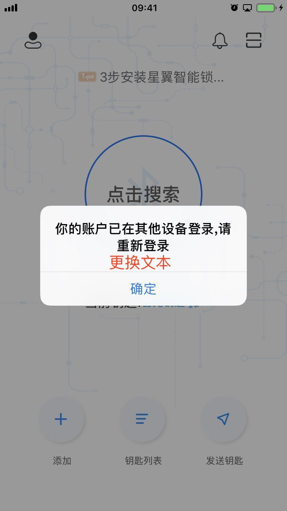
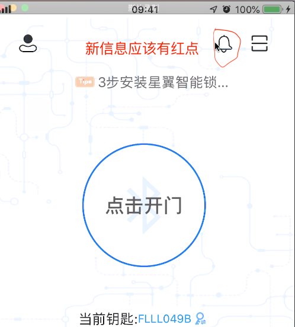
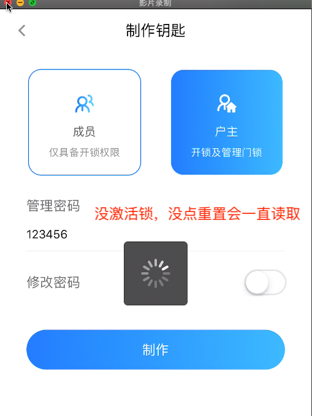
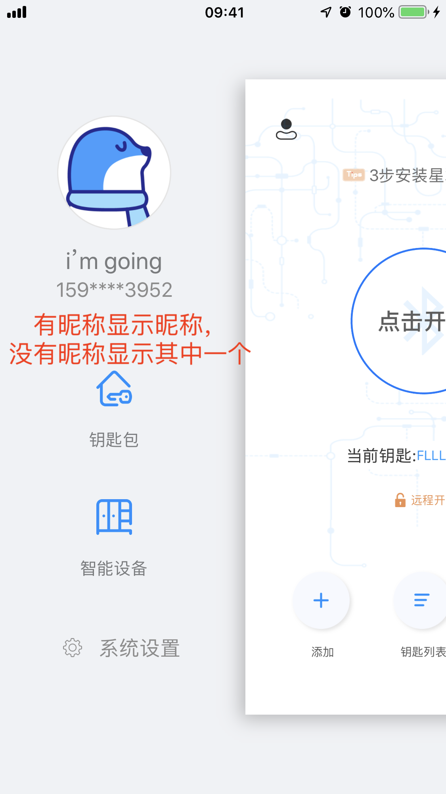

## 测试日志

### 2019-05-23

###登录

1. 优化内容，常用国家排在前面

2. 被其他设备顶下去的时候，更换提示文本，"你的账户已在其他设备登录，请重新登录。如不是本人登录，请及时更换密码"

3. 有新的信息时，没有红点提醒

   

4. 个人信息（修改头像，昵称，性别那个界面）的返回按钮太小，返回有延迟

###注册：

1. 注册时输入非法号码也会提示"验证码发送成功"
2. 邮箱登录，点击邮箱注册，跳转的是手机号注册界面，再次点击右上角才会跳到邮箱注册
3. 注册完之后没有立刻读取(user_info)接口，只有昵称，没有新注册的邮箱或电话的信息。

###配对新钥匙

1. 新配对钥匙的设备名称输入问题，特殊字符会存入字符串但不会显示，删除的时候会把不显示的字符全部删除后才删除显示出来的合法字符。
2. 设备没激活的情况下，制作钥匙，会一直读取，界面需要有提示"请重置门锁"
3. ***A手机录了人脸，能够开锁成功；换了B手机后，B手机无法识别

###安装网关：

1. 安装成功后七八秒还是会提示"请求超时"

###发送钥匙

1. ***app端发送远程钥匙发不下去***

###开锁：

1. app开锁，先激活锁后发指令，锁会开两次。先发指令后激活锁会各种报蓝牙连接超时

###Others：

1. 用户A最后一次登录的设备M，A用户退出M；M新登录了一个用户B后，A用户在其他设备N上登录时，B用户会被挤下线。(A最后一次的registerID和B的RegisterID是一样的)
2. 界面UI优化：

